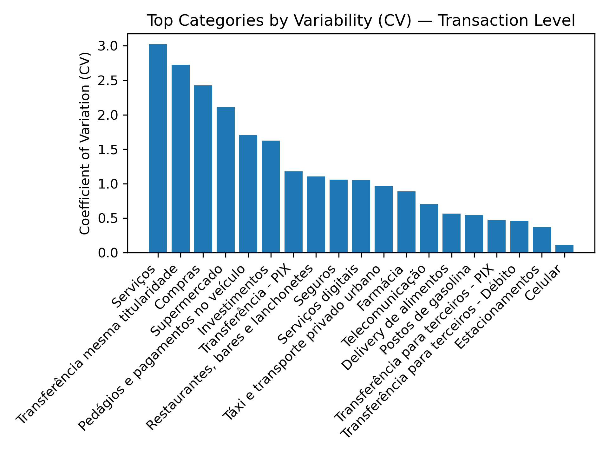

# Pattern Identification Report

The transaction dataset reveals distinct spending patterns across categories. Some, such as travel or electronics, show high variability, characterized by sporadic, high-value purchases followed by quiet periods. Others, such as subscriptions or rent, remain stable, reflecting recurring, predictable expenses.  

The plot below shows the coefficient of variation (CV) for several categories at the transaction level, illustrating this contrast.

  

To quantify volatility, two complementary metrics were developed:

1. Causal Coefficient of Variation (CV_{t})  
   $$
   CV_{t} = \frac{\sigma_{\text{past months}}}{\mu_{\text{past months}}}
   $$
   Calculated recursively per category using only past months, it measures relative variability and enables time-consistent monitoring.

2. Robust CV (CV^{R}_{t})  
   $$
   CV^{R}_{t} = \frac{1.4826 \times \text{MAD}_{\text{past months}}}{\text{Median}_{\text{past months}}}
   $$
   This robust version replaces mean and standard deviation with median and MAD, providing stable results under noisy or irregular data.  

Together, these metrics balance sensitivity and robustness, allowing adaptive thresholds that distinguish structural volatility from random fluctuations.

An adaptive outlier detection rule complements these metrics. For each category, a transaction \(x\) (its *effective outflow*) is flagged anomalous if any of the following conditions hold:
\[
|z| > \text{thr}_z, \quad |z| > 3.5, \quad \text{or} \quad x > Q_3 + 1.5(Q_3 - Q_1),
\]
where  
- \(z = (x - \mu_{\text{prev}})/\sigma_{\text{prev}}\) is the classical z-score,  
- \(Q_1\) and \(Q_3\) are the 25th and 75th percentiles of past data,  
- \(\text{thr}_z\) adapts to historical CV (2.5 for stable, up to 4.0 for volatile categories).  

All computations are causal, using only prior history, and account for refunds. Transactions quickly reversed (≥90% within 14 days) are excluded to avoid false positives.  

This framework detects both sudden anomalies and persistent shifts in user spending, forming the backbone of an adaptive, data-driven financial monitoring system.  
